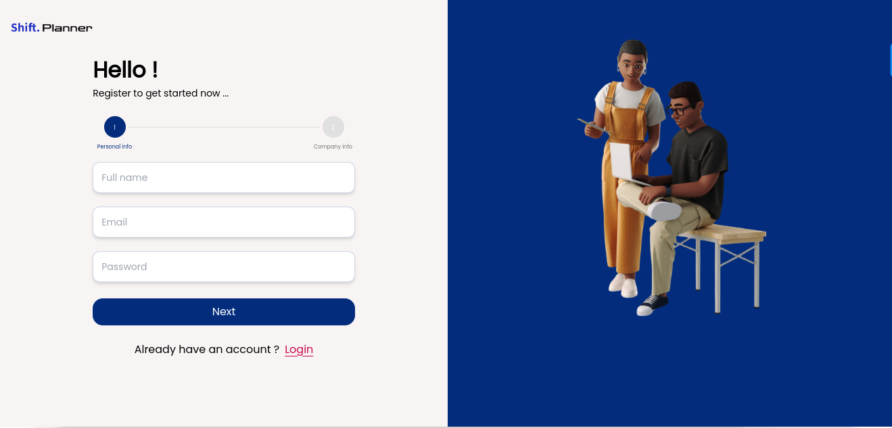
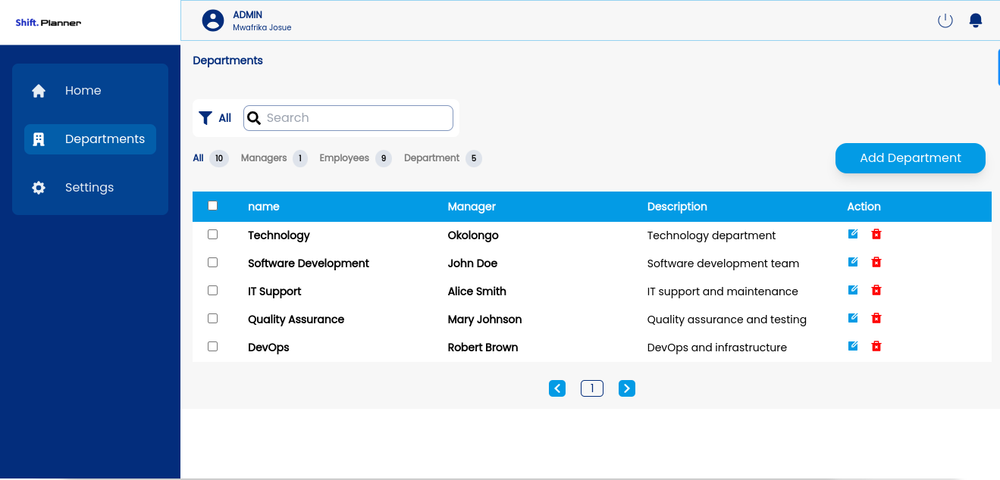
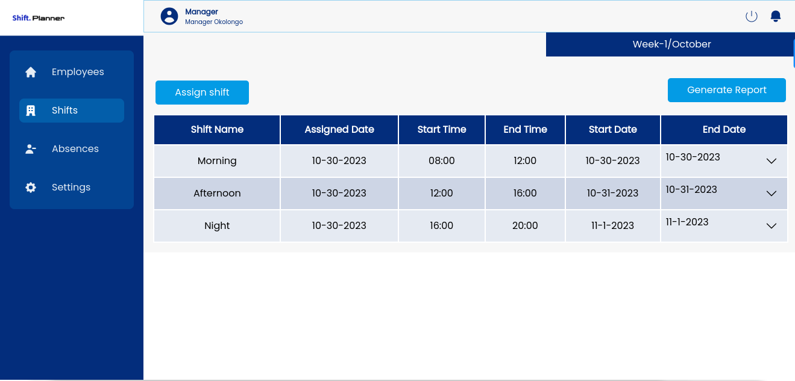
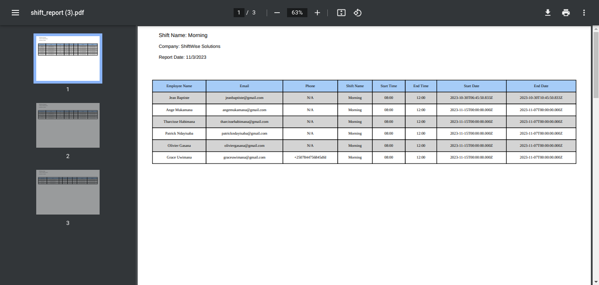
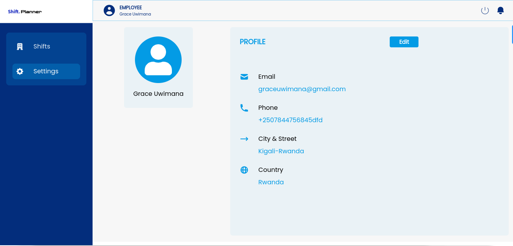

<!-- TABLE OF CONTENTS -->
# 📗 Table of Contents

- [📖 About the Project](#about-project)
  - [🛠 Built With](#built-with)
    - [Tech Stack](#tech-stack)
    - [Key Features](#key-features)
  - [🚀 Live Demo](#live-demo)
- [💻 Getting Started](#getting-started)
  - [Prerequisites](#prerequisites)
  - [Setup](#setup)
  - [Install](#install)
  - [Usage](#usage)
  - [Run tests](#run-tests)
  - [Deployment](#deployment)
- [👥 Authors](#authors)
- [🤝 Contributing](#contributing)
- [⭐️ Show your support](#support)
- [🙏 Acknowledgements](#acknowledgements)
- [❓ FAQ](#faq)
- [📝 License](#license)

<!-- PROJECT DESCRIPTION -->

# 📖 <a name="about-project">Shift PLanner</a>

**Shift Planner** is a powerful web application designed to assist company owners in managing employee schedules and shift assignments. With Shift Planner, employers can easily create and manage shifts, and assign workers to those shifts with ease.

In addition, Shift Planner also provides employees with the ability to request absences whenever they are needed. This feature allows workers to easily communicate their scheduling needs to their employer, improving communication and reducing scheduling conflicts.

Overall, Shift Planner is an essential tool for any business looking to streamline their scheduling process and improve communication between employers and employees.

## ScreenShots

### 1. Register/Login screen



### 2. Admin Actions 
Upon successful login, an Admin will be directed to their dashboard where they can perform various actions, such as adding a department.



### 3. Manager Actions 
After logging in successfully, a Manager will be directed to their dashboard, where they can carry out different tasks, including assigning shifts, viewing a list of employees in their department, and generating a report.





### 4. Employee Actions 
After logging in successfully, employees will be directed to their dedicated dashboard. This dashboard allows them to effortlessly access and manage their assigned shifts, while also providing the option to update their profile details as required.




## 🛠 Built With <a name="built-with"></a>

### Tech Stack <a name="tech-stack"></a>

<details>
  <summary>Client</summary>
  <ul>
    <li><a href="https://reactjs.org/">React.js</a></li>
  </ul>
</details>

<details>
  <summary>Server</summary>
  <ul>
    <li><a href="https://expressjs.com/">Express.js</a></li>
  </ul>
</details>

<details>
<summary>Database</summary>
  <ul>
    <li><a href="https://www.postgresql.org/">PostgreSQL</a></li>
  </ul>
</details>

<!-- Features -->

### Key Features <a name="key-features"></a>

- **Reporting:** Shift Planner also includes a reporting feature that allows employers to generate custom reports on employee schedules, shift assignments, and other important data.

- **Shift Management:** Shift Planner allows employers to easily create and manage shifts, and assign workers to those shifts with ease. This feature includes the ability to set shift times, assign workers to specific shifts, and view shift schedules.

- **Absence Management:** Shift Planner provides employees with the ability to request absences whenever they are needed. This feature allows workers to easily communicate their scheduling needs to their employer, improving communication and reducing scheduling conflicts.

<p align="right">(<a href="#readme-top">back to top</a>)</p>

<!-- LIVE DEMO -->

## 🚀 Live Demo <a name="live-demo"></a>

- [Live Demo Link](http://localhost:3001/signup)

<p align="right">(<a href="#readme-top">back to top</a>)</p>

<!-- GETTING STARTED -->

## 💻 Getting Started <a name="getting-started"></a>

To get a local copy up and running, follow these steps.

### Prerequisites

Make sure you have the following tools installed:

```sh
 Git and Node.js 
```

### Setup

Clone this repository to your desired folder:

```sh
  cd my-folder
  git clone https://github.com/mwafrika/shift-plan-frontend.git
```
-

### Install

Install dependencies:

```sh
  cd shift-plan-frontend
  npm install
```
-

### Usage

To run the project, execute the following command:

```sh
  npm run start:dev
```
-

### Deployment

You can deploy this project using:

```sh
 netlify or vercel 
```


<p align="right">(<a href="#readme-top">back to top</a>)</p>

<!-- AUTHORS -->

## 👥 Authors <a name="authors"></a>

👤 Mwafrika (Josué) Mufungizi

- GitHub: [@githubhandle](https://github.com/mwafrika)
- Twitter: [@twitterhandle](https://twitter.com/mwafrika_josue_)
- LinkedIn: [LinkedIn](https://www.linkedin.com/in/mwafrika-mufungizi)

👤 Nicole Ciragane
 
- GitHub: [@githubhandle](https://github.com/ciraganenicole)
- Twitter: [@twitterhandle](https://twitter.com/CiraganeN)
- LinkedIn: [LinkedIn](https://www.linkedin.com/in/nicole-ciragane-19a3071bb/)


👤 Jeffrey Dauda

- GitHub: [@githubhandle](https://github.com/jefftrojan)
<!-- - Twitter: [@twitterhandle](https://twitter.com/) -->
- LinkedIn: [jeffdauda](https://www.linkedin.com/in/jeffdauda/)


👤 Joseph Irirwanirira


- GitHub: [@Irirwanirira](https://github.com/Irirwanirira)
- Twitter: [@iri_joseph](https://twitter.com/Iri_joseph)
- LinkedIn: [Joseph Irirwanirira](https://linkedin.com/in/joseph-irirwanirira-74666623a/)


<p align="right">(<a href="#readme-top">back to top</a>)</p>

<!-- CONTRIBUTING -->

## 🤝 Contributing <a name="contributing"></a>

Contributions, issues, and feature requests are welcome!

Feel free to check the [issues page](https://github.com/mwafrika/shift-plan-frontend/issues).

<p align="right">(<a href="#readme-top">back to top</a>)</p>

<!-- SUPPORT -->

## ⭐️ Show your support <a name="support"></a>

If you found Shift Planner to be a valuable tool for managing shifts and improving scheduling efficiency, we kindly request that you consider leaving a star on our GitHub repository. Your support would mean a lot to us and would motivate us to further enhance and refine the application. Thank you for your consideration!

<p align="right">(<a href="#readme-top">back to top</a>)</p>

<!-- ACKNOWLEDGEMENTS -->

## 🙏 Acknowledgments <a name="acknowledgements"></a>

We would like to extend our heartfelt appreciation to the COA team for their brilliant project idea. Their innovative thinking and creativity have paved the way for the development of an exceptional solution like Shift Planner. Their contribution has been instrumental in creating a tool that simplifies shift management and enhances productivity. Thank you, COA team, for your invaluable project idea!

<p align="right">(<a href="#readme-top">back to top</a>)</p>

<!-- FAQ (optional) -->

## ❓ FAQ  <a name="faq"></a>

- **What are the system requirements for running Shift Planner?**

  - Shift Planner has specific system requirements to ensure optimal performance. New developers may inquire about the supported operating systems, required versions of Node.js and other dependencies, and any additional software or hardware prerequisites.

- **Is there any documentation or user guide available to help with the setup and usage of Shift Planner?**

  - New developers often seek comprehensive documentation or user guides to understand the installation process, configuration options, and how to utilize the various features of Shift Planner effectively. They may inquire about the availability of such resources to aid them in getting started with the project.

<p align="right">(<a href="#readme-top">back to top</a>)</p>

<!-- LICENSE -->

## 📝 License <a name="license"></a>

This project is [MIT](./LICENSE) licensed.

<p align="right">(<a href="#readme-top">back to top</a>)</p>


## API Documentation Link
For detailed API documentation, please visit the [Wallet App API Documentation](https://documenter.getpostman.com/view/6127109/2s9Y5SX5zy)
.


<!-- ## Tools and IDEs
- Vite
- Postman
- vscode -->

## Getting Started

To set up the application locally, follow these steps:

### Prerequisites

Make sure you have the following tools installed:

- Git
- Node.js

### Setup

1. Clone the repository:

```js 
git clone https://github.com/mwafrika/task-force.git
```

#### 2. Navigate to the project directory:
```js 
cd task-force
```
```js
Create .env files in both the frontend and backend directories, and copy the contents of .env.example into them. Update the credentials as required.
```

## Running the Application

### A. Frontend
  - Navigate to the frontend directory:

   ```js
   cd frontend
   ```
   - Install dependencies:
   ```js
   npm install
   ```
   - Run the development server:
   ```js
   npm run dev
   ```

### B. Backend 
   - Navigate to the frontend directory:

   ```js
   cd backend
   ```
   - Install dependencies:
   ```js
   npm install
   ```
   - Run the development server:
   ```js
   npm start
   ```
   
Remember to update the .env files with the appropriate credentials before starting the servers.


## Screenshots

### 1. Register/Login screen


### 2. Initial Dashboard 
After a successful login, you will be redirected to the dashboard where you can see all your accounts and transactions.


### 3. Track all in and out transactions from each account
To see the transactions associated with a particular account, click on the account name. You will be able to load all the transactions associated with that account.


### 4. Modal to create new records (e.g. new account)


### 5. Generate a report according to the desired time gap.
In order to view the transactions reports, you need to click "Transaction Report button" then select the date interval (starting from when you have created a new transaction) to see the report of transactions associated with that account.


<!-- ## Live Demo -->

<!-- [Live Demo Link]() -->


## Authors

👤 **Mwafrika Josué**

- GitHub: [@mwafrika](https://github.com/mwafrika)
- Twitter: [@mwafrika](https://twitter.com/mwafrika_josue_)
- LinkedIn: [@mwafrika](https://linkedin.com/in/mwafrika-mufungizi)

## 🤝 Contributing

Contributions, issues, and feature requests are welcome!

Feel free to check the [issues page](https://github.com/mwafrika/task-force/issues).

## Show your support

Give a ⭐️ if you like this project!

## Acknowledgments

- Inspiration
- etc

## 📝 License

This project is [MIT](./MIT.md) licensed.


<!-- Please give us a brief summary of your program, what you're proud of, and what you wish you had done to improve it. This question is optional but we will take into account anything you say. -->

